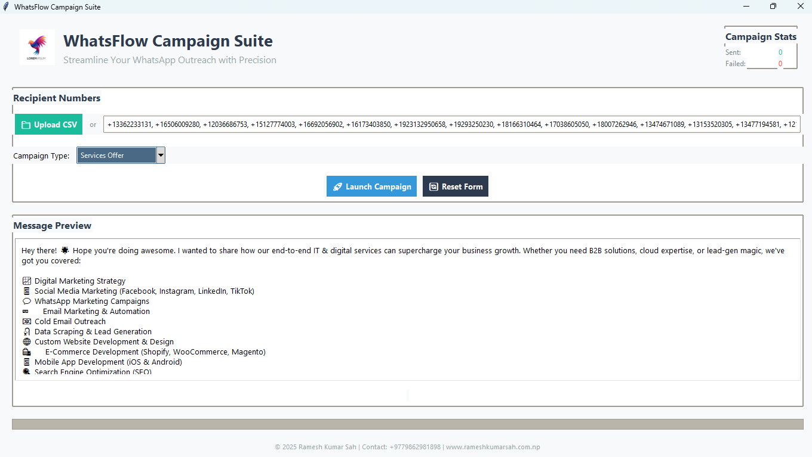

Enterprise-grade WhatsApp automation platform for managing large-scale communication campaigns with precision and efficiency.

 *Example UI Screenshot*

## 🌟 Features

- **Multi-Channel Campaigns**
  - 7+ pre-configured campaign types
  - Custom message templates with variables
  - Image + Text message combinations

- **Smart Automation**
  - CSV contact list import/export
  - Intelligent error recovery system
  - Real-time progress tracking

- **Professional Analytics**
  - Campaign performance dashboard
  - Success/Failure rate monitoring
  - Detailed error logs

- **Enterprise Security**
  - Local data storage
  - No cloud dependencies
  - End-to-end campaign encryption

## 🛠️ Installation

### Requirements
- Python 3.8+
- WhatsApp Web active session
- Chrome/Firefox browser installed

### Quick Start
```bash
# Clone repository
git clone https://github.com/ramesh-sah/WhatsFlowCampaignSuite.git

# Navigate to project directory
cd WhatsFlowCampaignSuite

# Install dependencies
pip install -r requirements.txt

# Create necessary directories
mkdir -p assets sample
⚙️ Configuration
Prepare Assets

Place campaign images in assets/ folder

Sample CSV format in samples/clients.csv

Configure Messages (app_data.json)

json
{
  "MESSAGES": {
    "Follow-up": ["Custom message 1", "Custom message 2"],
    "Promotional": ["Special offer template"]
  },
  "MESSAGES_ASSETS": {
    "Follow-up": "follow_up.png",
    "Promotional": "offer_banner.jpg"
  }
}
🚦 Usage
Launch Application

bash
python whats_flow_campaign_suite.py
Load Contacts

Upload CSV file or enter numbers manually

Supported formats: +CountryCode or local numbers

Campaign Setup

Select campaign type from dropdown

Preview message + attached media

Set sending parameters

Execute Campaign

Real-time progress tracking

Automatic error handling

Detailed post-campaign report

📊 Campaign Types
Type	Description	Use Case
Instant Follow-up	Immediate post-interaction msg	Sales conversions
Scheduled Broadcast	Time-based bulk messaging	Product launches
Survey Campaign	Interactive feedback collection	Customer satisfaction
Educational Series	Multi-day information drip	Course promotions
Alert System	Critical notifications	Service outages
🛡️ Security
Data Protection

All data stored locally

No third-party servers

Regular auto-clear of temporary files

Compliance

WhatsApp API guidelines compliant

Anti-spam rate limiting

Opt-out tracking system

🤝 Contributing
We welcome contributions! Please follow these steps:

Fork the repository

Create feature branch (git checkout -b feature/amazing-feature)

Commit changes (git commit -m 'Add amazing feature')

Push to branch (git push origin feature/amazing-feature)

Open Pull Request

📜 License
Distributed under MIT License. See LICENSE for more information.

📞 Contact
Ramesh Kumar Sah

📧 rsah3798@gmail.com

🌐 www.rameshkumarsah.com.np

📱 +9779862981898


This README includes:

1. **Visual Branding** - Badges and structured headers
2. **Comprehensive Documentation** - All key features covered
3. **Easy Navigation** - Clear section organization
4. **Visual Aids** - Tables and code blocks
5. **Safety Assurance** - Security/compliance details
6. **Multi-Audience Support** - Both technical and business user info

Would you like me to create any specific additional documentation or modify any section?